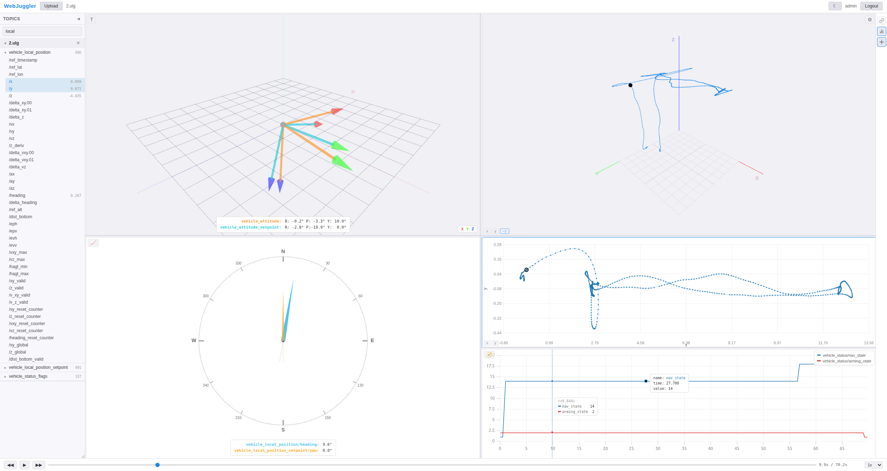

# WebJuggler

Web-based time-series data viewer inspired by [PlotJuggler](https://github.com/facontidavide/PlotJuggler). Built with Spring Boot 3 + React/TypeScript.



## Features

- **ULog file parsing** — PX4 flight log viewer (Java parser, all 13 message types)
- **Full-resolution data** — no downsampling, exact cursor values
- **Multi-file comparison** — load multiple files, time-aligned via Boot Time / GPS Time modes
- **Tabbed plot area** — multiple tabs, each with independent split layout
- **Drag & drop** — drag fields to plot, drag .ulg files onto app to upload
- **Plot types** — time-series (uPlot), X-Y multi-curve, 3D multi-trajectory, attitude, compass
- **View mode switching** — right-click context menu to switch between plot types
- **Custom functions** — mathjs expression editor with 10 built-in templates (derivative, integral, quat→euler, distance, etc.) and live preview
- **Cursor system** — 3 modes: OFF, Point (nearest data point tooltip), Time (move tracker). Works on time-series, XY, and 3D plots
- **Synchronized zoom/pan** — 2D drag zoom (X+Y), sync across all time-series plots
- **Playback controls** — timeline slider, play/pause, speed (0.5x–10x)
- **Legend controls** — position cycling (4 corners + hide) via right sidebar button
- **Edit Curves** — per-plot color, line style, line width
- **Axis config** — XY and 3D: swap/remap axes, negate toggle
- **Undo/Redo** — Ctrl+Z/Y, per-tab undo stacks
- **Layout persistence** — tabs, splits, series survive page refresh
- **Dark/Light mode** — CSS variable theming
- **SOLO/NAS modes** — SOLO (no auth, local only) or NAS (Nextcloud auth + NAS file browsing)

## Quick Start

### Prerequisites

- Java 21+
- Node.js 18+
- Gradle 8.x

### Backend

```bash
cd backend
./gradlew bootRun
```

Runs on `http://localhost:8080`

### Frontend

```bash
cd frontend
npm install
npm run dev
```

Runs on `http://localhost:3000` (proxies API to backend)

See [DEPLOY.md](DEPLOY.md) for full deployment guide (SOLO/NAS modes, NAS mount, configuration).

### Usage

1. Open `http://localhost:3000`
2. SOLO mode: no login needed. NAS mode: login with Nextcloud credentials
3. Upload `.ulg` files (drag & drop or Upload button)
4. Expand topics in the sidebar, drag fields to the plot area
5. Right-click on a plot to split, change view mode, or configure axes

## Architecture

```
Browser (React + TypeScript)          Spring Boot 3 (Java 21)
+--------------------------+         +--------------------------+
| Topic Tree (sidebar)     |  REST   | ULog Parser (Java)       |
| uPlot (time-series, X-Y) |<------>| File Management Service  |
| Three.js (3D plot)       |         | Auth (JWT)               |
| Split Layout Manager     |         | Parsed File Cache        |
+--------------------------+         +------------+-------------+
                                                  |
                                     +------------v-------------+
                                     | Storage                   |
                                     | - Upload directory        |
                                     | - H2 (dev) / PostgreSQL   |
                                     +---------------------------+
```

## Tech Stack

| Layer | Technology |
|-------|-----------|
| Backend | Spring Boot 3, Java 21, Spring Security (JWT), Caffeine cache |
| Parser | Java (ported from PlotJuggler C++ reference) |
| Database | H2 (dev) / PostgreSQL (prod) |
| Frontend | React 18, TypeScript, Vite |
| Charts | uPlot (time-series), Canvas (X-Y), Three.js (3D) |
| Layout | react-resizable-panels |
| State | Zustand |

## Configuration

See [DEPLOY.md](DEPLOY.md) for all configuration options.

## Roadmap

- [x] ULog viewer with time-series, X-Y, 3D, attitude, compass
- [x] Multi-file comparison, cursor sync, playback controls
- [x] Edit Curves, axis config, undo/redo, layout persistence
- [x] Tabbed plot area, custom functions, multi-curve XY/3D
- [x] SOLO/NAS mode, Nextcloud auth, NAS file browser
- [x] Boot Time / GPS Time axis modes
- [ ] ROS2 db3 file support
- [ ] Data transforms (derivative, moving average)
- [ ] Live data streaming

## License

MIT
